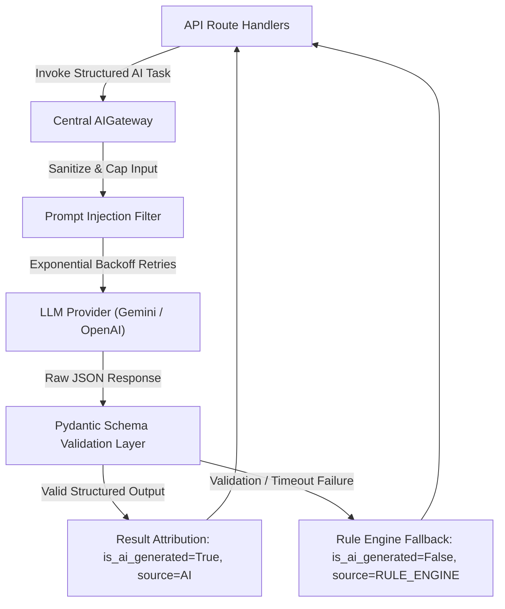

# PlaceMind AI Gateway & Architecture Specification

This document defines the production AI architecture, centralized gateway abstraction, Pydantic response validation schemas, resilience strategies, token cost tracking, prompt injection mitigations, and explainable candidate match scoring boundaries for PlaceMind.

---

## 1. Centralized AI Gateway Architecture

All AI features (resume analysis, JD extraction, skill-gap analysis, assessment generation, interview evaluation, code complexity analysis, candidate match explanation) route strictly through the centralized [`AIGateway`](file:///c:/Users/Nitesh%20Kumar/OneDrive/Desktop/Web%20Dev/D_AI_HACKATHON/AI-Campus-Placement-Agent/backend/app/services/ai_gateway.py#L125-L230).



---

## 2. Security & Resilience Controls

| Control | Limit / Spec | Description |
| :--- | :--- | :--- |
| **Max Prompt Length** | `16,000 chars` | Inputs exceeding 16,000 characters are automatically truncated. |
| **Prompt Injection Protection** | Pattern Filter | Regex filters strip injection attempts (`IGNORE PREVIOUS INSTRUCTIONS`, `SYSTEM:` overrides). |
| **Wall-Clock Timeout** | `10.0 seconds` | API calls exceeding 10.0s time out safely. |
| **Exponential Backoff Retries** | `3 Max Retries` | Retries on network/timeout failures (`0.5s`, `1.0s`, `2.0s`). |
| **Schema Validation** | Pydantic Models | Raw LLM JSON is strictly validated using Pydantic schemas (`AIResumeAnalysisSchema`, `AIJDExtractionSchema`, etc.). |
| **Token & Cost Tracking** | Real-time Metrics | Tracks `prompt_tokens`, `completion_tokens`, `total_tokens`, and `estimated_cost_usd`. |

---

## 3. Deterministic Boundaries vs Recommendation-Only AI

AI output is strictly **recommendation-only** for hiring and candidate shortlisting decisions.

### Deterministic Hard Cutoffs
The following rules are executed strictly by canonical Python engines (`eligibility_engine.py` and `skill_matching_engine.py`):
1. **CGPA Cutoff**: Candidate CGPA $\ge$ Drive minimum CGPA.
2. **Backlog Limit**: Candidate active backlogs $\le$ Drive maximum backlogs.
3. **Eligible Branch**: Candidate department in Drive allowed branches.
4. **Graduation Batch**: Candidate graduation year in Drive allowed years.

### Explainable Match Score Breakdown
Every candidate match report provides an explicit 6-factor score breakdown:
* `eligibility`: `100.0` or `0.0` (Deterministic)
* `skills`: `0.0 - 100.0` (Skill intersection ratio)
* `assessment`: `0.0 - 100.0` (Standardized coding test score)
* `experience`: `0.0 - 100.0` (Project relevance)
* `cgpa`: `0.0 - 100.0` (Academic weighted score)
* `role_fit`: `0.0 - 100.0` (Combined recommendation score)

---

## 4. Result Attribution Metadata

Every AI-assisted endpoint attaches standardized attribution metadata:
```json
{
  "is_ai_generated": true,
  "source": "AI",
  "provider": "gemini",
  "model": "gemini-1.5-flash",
  "execution_time_ms": 420.5,
  "tokens": {
    "prompt_tokens": 140,
    "completion_tokens": 85,
    "total_tokens": 225,
    "estimated_cost_usd": 0.000034
  }
}
```
If the AI service is unreachable, degraded, or returns invalid JSON, the gateway returns a curated rule-engine fallback with `"is_ai_generated": false` and `"source": "RULE_ENGINE"`.
