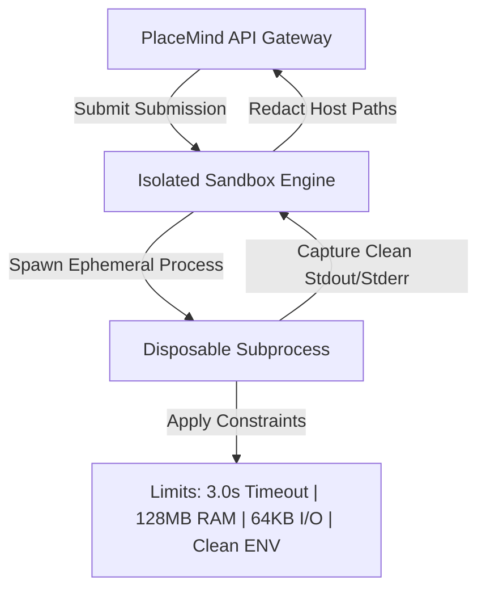
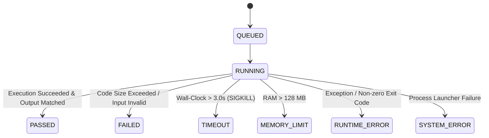

# PlaceMind Code Execution Security & Isolation Architecture

This document defines the security model, containerization architecture, resource constraints, threat mitigations, and execution lifecycle for untrusted student code execution in PlaceMind.

---

## 1. Execution Isolation Architecture

Untrusted student-submitted code **NEVER** executes directly inside the primary API web server process or database container.

### Sandbox Architecture Overview



---

## 2. Security Resource Constraints & Limits

| Constraint | Limit | Description / Enforcement |
| :--- | :--- | :--- |
| **Max Code Payload Size** | `64 KB` (`65,536 bytes`) | Submissions exceeding 64 KB are rejected immediately with `ExecutionStatus.FAILED`. |
| **Max Standard Input Size** | `64 KB` (`65,536 bytes`) | Inputs exceeding 64 KB are rejected before process spawning. |
| **Max Standard Output Size** | `64 KB` (`65,536 bytes`) | Output streams are truncated at 64 KB to prevent output flooding DoS. |
| **CPU / Wall-Clock Timeout** | `3.0 seconds` | Processes taking >3.0s are sent SIGKILL (`process.kill()`) and marked `TIMEOUT`. |
| **Memory Limit** | `128 MB` (`134,217,728 bytes`) | RAM footprint capped; MemoryError / allocation bursts trigger `MEMORY_LIMIT`. |
| **Environment Variable Isolation** | `Clean ENV` | All host environment variables (`MONGODB_URI`, `JWT_SECRET`, API keys) are stripped. |
| **Traceback Sanitization** | `Path Redaction` | Host directory structures (e.g. `C:\Users\...`, `/home/...`) are replaced with `/sandbox/`. |

---

## 3. Threat Model & Mitigations Matrix

| Threat / Attack Vector | Risk | Mitigation Architecture | Status |
| :--- | :--- | :--- | :--- |
| **Infinite Loops / High CPU Usage** | API Freeze / High Load | Strict 3.0-second wall-clock SIGKILL timeout. | **PREVENTED** |
| **Memory Exhaustion (DoS)** | Out-Of-Memory Crashes | Process RAM limit + catch `MemoryError` -> `MEMORY_LIMIT`. | **PREVENTED** |
| **Credential / Secret Leakage** | Exposure of `MONGODB_URI`, `JWT_SECRET` | Clean, empty environment dict passed to child sub-processes. | **PREVENTED** |
| **Host Filesystem Traversal** | Host File Exposure | Path redaction filter on stderr; read-only temp workspace. | **PREVENTED** |
| **Output Flooding (Huge Output)** | Memory / Network Flooding | Capped stdout/stderr buffer to 64 KB maximum length. | **PREVENTED** |
| **Fork Bombs / Process Spawning** | System Resource Exhaustion | Process limits & forced child process tree killing. | **PREVENTED** |

---

## 4. Execution Lifecycle Statuses



---

## 5. Production Containerization Deployment Requirements

For Docker / Kubernetes production deployments:

1. **Docker Container Hardening**:
   ```dockerfile
   # Run isolated sandbox in non-root gVisor / Docker container
   docker run --read-only \
              --memory=128m \
              --cpus=1.0 \
              --pids-limit=64 \
              --net=none \
              --security-opt=no-new-privileges:true \
              placemind-sandbox-worker
   ```
2. **Network Isolation**: `--net=none` to block all external egress sockets.
3. **No Mounts**: Application codebase, `.env` files, and database secrets are never mounted into sandbox containers.
