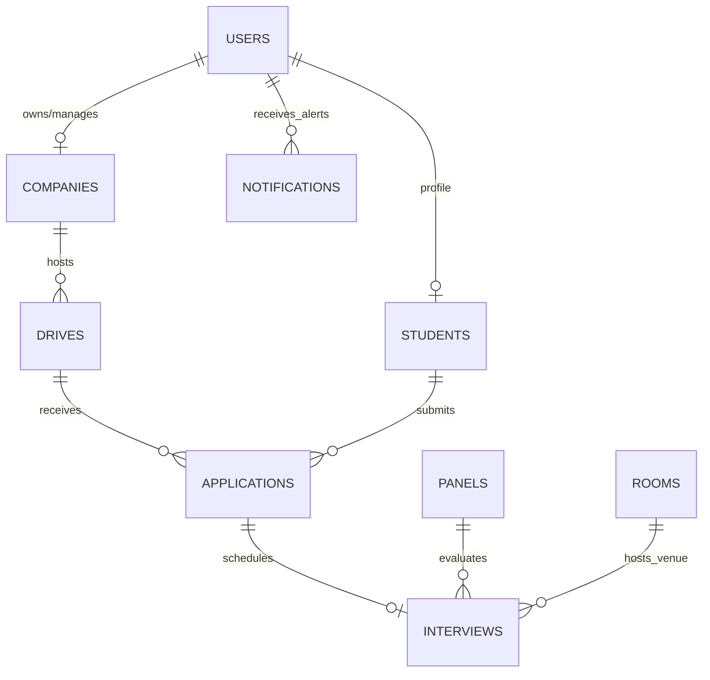

# PlaceMind Canonical Data Model & API Contract Specification

This document defines the single source of truth for all database entities, canonical `snake_case` fields, inter-entity relationships, MongoDB unique indexes, and Pydantic API schemas across PlaceMind.

---

## 1. Primary Database Entities & Canonical Fields

### 1.1 `users` Collection
* **Primary Key**: `id` (`usr-<uuid>`)
* **Canonical Fields**:
  * `id`: `str` (Unique identifier)
  * `email`: `str` (Normalized lowercased email, Unique Index)
  * `password_hash`: `str` (Argon2id hashed secret string)
  * `role`: `str` (`student`, `recruiter`, `placement_officer`, `panel_member`, `admin`)
  * `name`: `str` (Full user display name)
  * `company_id`: `Optional[str]` (Foreign key to `companies.id` for recruiters)
  * `company_name`: `Optional[str]` (Company display name)
  * `is_active`: `bool` (Account status, default `True`)
  * `created_at`: `str` (ISO 8601 timestamp)

### 1.2 `students` Collection
* **Primary Key**: `id` (`usr-<roll_number>`)
* **Canonical Fields**:
  * `id`: `str` (Unique student identifier)
  * `roll_number`: `str` (Institutional student roll number)
  * `name`: `str` (Student full name)
  * `email`: `str` (Unique lowercased student email)
  * `branch`: `str` (Department, e.g. `CSE`, `ECE`, `IT`, `MECH`)
  * `graduation_year`: `int` (Graduation batch year, e.g. `2027`)
  * `cgpa`: `float` (Cumulative Grade Point Average)
  * `skills`: `List[str]` (List of verified candidate skills)
  * `readiness_score`: `float` (Algorithmic placement readiness percentage)
  * `resume_id`: `Optional[str]` (Foreign key to `resumes.id`)
  * `resume_url`: `Optional[str]` (URL or filename of uploaded resume)
  * `placement_status`: `str` (`unplaced`, `shortlisted`, `placed`)
  * `applications_count`: `int` (Number of submitted drive applications)
  * `shortlists_count`: `int` (Number of shortlists)
  * `interviews_count`: `int` (Number of scheduled interviews)

### 1.3 `companies` Collection
* **Primary Key**: `id` (`comp-<uuid>`)
* **Canonical Fields**:
  * `id`: `str` (Unique company identifier)
  * `name`: `str` (Clean company name)
  * `company_key`: `str` (Unique alphanumeric deduplication key, Unique Index)
  * `industry`: `str` (Industry domain, e.g. `Technology / Software`)
  * `tier`: `str` (`Tier 1`, `Tier 2`, `Dream`, `Super Dream`)
  * `location`: `str` (Headquarters / Office location)
  * `website`: `Optional[str]` (Corporate website URL)
  * `contact_person`: `Optional[str]` (Recruiter contact name)
  * `contact_email`: `Optional[str]` (Recruiter contact email)

### 1.4 `drives` Collection
* **Primary Key**: `id` (`drive-<company_slug>-<uuid>`)
* **Canonical Fields**:
  * `id`: `str` (Unique placement drive identifier)
  * `company_id`: `str` (Foreign key to `companies.id`)
  * `company_name`: `str` (Corporate company name)
  * `role_title`: `str` (Job role title, e.g. `Software Development Engineer`)
  * `package_lpa`: `float` (Compensation package in Lakhs Per Annum)
  * `location`: `str` (Job location / Hybrid work mode)
  * `eligible_branches`: `List[str]` (Branches permitted to apply)
  * `min_cgpa`: `float` (Minimum CGPA cut-off)
  * `graduation_years`: `List[int]` (Eligible graduation batch years)
  * `max_backlogs`: `int` (Maximum allowable active backlogs)
  * `required_skills`: `List[str]` (Core technical requirements)
  * `preferred_skills`: `List[str]` (Secondary preferred technical skills)
  * `status`: `str` (`PENDING_APPROVAL`, `ANNOUNCED`, `ACTIVE`, `REJECTED`, `CLOSED`)
  * `recruiter_id`: `str` (Foreign key to creating `users.id`)
  * `registered_count`: `int` (Total candidate application count)
  * `shortlisted_count`: `int` (Total shortlisted candidate count)
  * `created_at`: `str` (ISO timestamp)

### 1.5 `applications` Collection
* **Primary Key**: `id` (`app-<student_id>-<drive_id>`)
* **Canonical Fields**:
  * `id`: `str` (Unique application identifier)
  * `student_id`: `str` (Foreign key to `students.id`)
  * `drive_id`: `str` (Foreign key to `drives.id`)
  * `company_id`: `str` (Foreign key to `companies.id`)
  * `company_name`: `str` (Company name)
  * `job_title`: `str` (Role title)
  * `status`: `str` (`APPLIED`, `SHORTLISTED`, `REJECTED`, `INTERVIEW_SCHEDULED`, `SELECTED`)
  * `applied_at`: `str` (ISO timestamp)
  * `aptitude_score`: `Optional[float]` (Aptitude assessment score)
  * `technical_score`: `Optional[float]` (Technical coding score)
  * `hr_score`: `Optional[float]` (HR interview rating)

### 1.6 `interviews` Collection
* **Primary Key**: `id` (`int-<uuid>`)
* **Canonical Fields**:
  * `id`: `str` (Unique interview identifier)
  * `application_id`: `str` (Foreign key to `applications.id`)
  * `student_id`: `str` (Foreign key to `students.id`)
  * `drive_id`: `str` (Foreign key to `drives.id`)
  * `panel_id`: `str` (Foreign key to `panels.id`)
  * `panel_name`: `str` (Assigned interview panel title)
  * `room_id`: `str` (Foreign key to `rooms.id`)
  * `room_number`: `str` (Assigned venue room number)
  * `block`: `str` (Campus building block)
  * `date`: `str` (Scheduled date `YYYY-MM-DD`)
  * `time_slot`: `str` (Scheduled time range `10:00 AM - 10:30 AM`)
  * `status`: `str` (`SCHEDULED`, `CONFIRMED`, `COMPLETED`, `CANCELLED`)

### 1.7 `notifications` Collection
* **Primary Key**: `id` (`notif-<uuid>`)
* **Canonical Fields**:
  * `id`: `str` (Unique notification identifier)
  * `notification_key`: `str` (Idempotency key, Unique Index)
  * `recipient_id`: `str` (Recipient user ID or email)
  * `recipient_role`: `str` (`student`, `recruiter`, `placement_officer`)
  * `type`: `str` (`NEW_DRIVE_AVAILABLE`, `APPLICATION_SHORTLISTED`, `INTERVIEW_SCHEDULED`)
  * `title`: `str` (Notification heading)
  * `message`: `str` (Detailed alert text)
  * `read`: `bool` (Read status, default `False`)
  * `created_at`: `str` (ISO timestamp)

---

## 2. Entity Relationships Diagram (Mermaid)

---

## 3. Database Index & Unique Constraint Specifications

| Collection | Target Fields | Index Type | Unique Constraint | Purpose |
| :--- | :--- | :--- | :--- | :--- |
| `users` | `email` | ASCENDING | `True` (sparse) | Prevents duplicate user registrations |
| `users` | `id` | ASCENDING | `True` (sparse) | Enforces unique primary key lookup |
| `students` | `email` | ASCENDING | `True` (sparse) | Student email uniqueness |
| `students` | `id` | ASCENDING | `True` (sparse) | Student ID uniqueness |
| `companies` | `company_key` | ASCENDING | `True` (sparse) | Prevents duplicate corporate entities |
| `drives` | `id` | ASCENDING | `True` (sparse) | Drive lookup primary key |
| `applications` | `(student_id, drive_id)` | COMPOUND ASCENDING | `True` (sparse) | Prevents duplicate student applications to same drive |
| `notifications` | `notification_key` | ASCENDING | `True` (sparse) | Enforces idempotent notification dispatch |
| `resumes` | `student_id` | ASCENDING | `True` (sparse) | Enforces single canonical student resume |
| `community_responses` | `(student_id, drive_id)` | COMPOUND ASCENDING | `True` (sparse) | Prevents duplicate drive registration forms |

---

## 4. API Request & Response Contracts

* **Python Internal Representation**: Canonical `snake_case` attributes.
* **API Serialized Output**: Automatic `camelCase` alias generation for frontend JavaScript clients using `pydantic.alias_generators.to_camel`.
