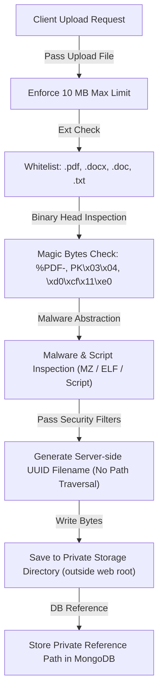

# PlaceMind File Upload & Resume Storage Security Architecture

This document defines the file security controls, magic bytes signature validation, malware scanning abstraction, server-side UUID filename generation, private storage management, and RBAC candidate resume protection for PlaceMind.

---

## 1. File Upload Validation Controls

All document and resume file uploads route strictly through [`file_security_service.py`](file:///c:/Users/Nitesh%20Kumar/OneDrive/Desktop/Web%20Dev/D_AI_HACKATHON/AI-Campus-Placement-Agent/backend/app/services/file_security_service.py).

---

## 2. Security Controls & Enforcements

| Security Control | Spec / Limit | Description |
| :--- | :--- | :--- |
| **Max File Size** | `10 MB` (`10,485,760 bytes`) | Uploads exceeding 10 MB are rejected immediately with HTTP 400. |
| **Allowed Extensions** | `.pdf`, `.docx`, `.doc`, `.txt` | Unapproved extensions (e.g. `.exe`, `.sh`, `.php`, `.js`) are blocked. |
| **MIME & Magic Bytes Check** | Binary Signature | Verifies magic bytes (`%PDF-`, `PK\x03\x04`, `\xd0\xcf\x11\xe0`) to prevent file extension spoofing. |
| **Path Traversal Protection** | UUID Filename | User-supplied filenames are ignored. Server-side UUID names (`{student_id}_{uuid}.pdf`) are generated. |
| **Malware Inspection** | Signature Scanner | Scans file headers for Windows PE (`MZ`), Linux (`ELF`), and `<script>` injection tags. |
| **Storage Location** | Private Storage | Files are stored in `storage/resumes/` outside public web server static directories. |

---

## 3. RBAC Candidate Resume Access Protection

Candidate resumes are **NEVER publicly accessible** via raw filesystem URLs.

### Download Access Matrix (`GET /api/resumes/download/{resume_id}`)
* **Candidate Owner**: Allowed to download their own resume.
* **Verified Recruiter / Placement Officer / Admin**: Allowed to download resumes for drive evaluation.
* **Unauthorized Student B**: Blocked with `HTTP 403 Forbidden`.

---

## 4. Deletion & Retention Lifecycle

* **Automated Cleanup**: Uploading a new resume automatically deletes the student's previous binary file from private storage.
* **Explicit Endpoint**: `DELETE /api/resumes/{resume_id}` securely removes binary files and clears database records.
