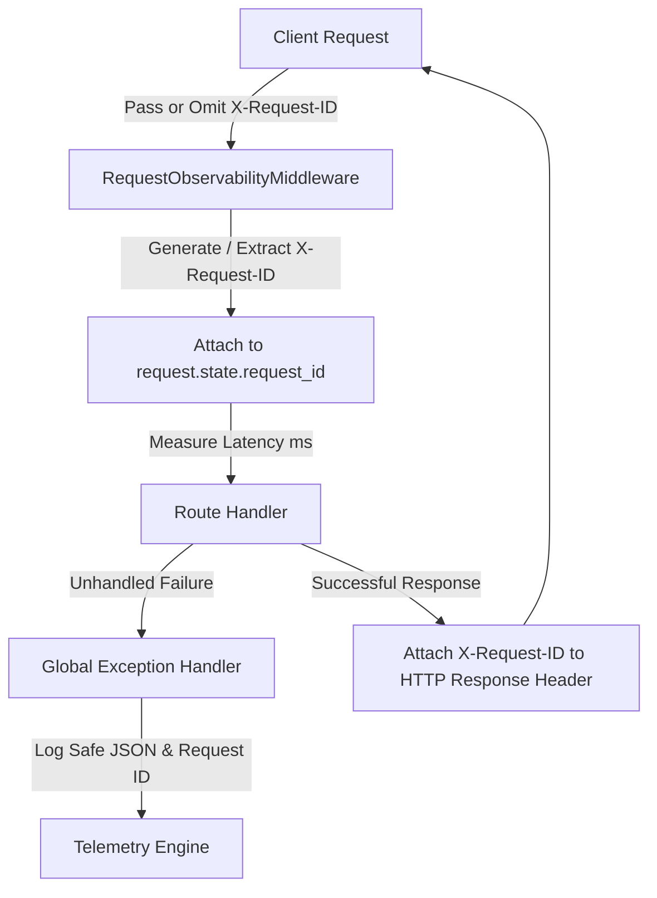

# PlaceMind Observability, Logging & Error Handling Architecture

This document defines the production observability stack, structured JSON logging schemas, request tracing with `X-Request-ID`, sensitive data redaction rules, global exception handling, operational telemetry endpoints, and Sentry error tracking integration for PlaceMind.

---

## 1. Request Tracing & Correlation Architecture

Every HTTP request passing through PlaceMind is assigned a unique 12-character hexadecimal correlation identifier (`X-Request-ID`).



---

## 2. Structured JSON Event Logging Schema

PlaceMind emits machine-readable, structured JSON logs to `stdout` for ingestion by CloudWatch, Datadog, ELK, or Loki log aggregators.

### Example Structured HTTP Request Event Log
```json
{
  "timestamp": "2026-08-27T21:28:00.123456+00:00",
  "event_type": "HTTP_REQUEST",
  "details": {
    "request_id": "8f3a12bc90de",
    "method": "POST",
    "endpoint": "/api/assessments/submit",
    "status": 200,
    "latency_ms": 42.5,
    "user_id": "student-101",
    "role": "student"
  }
}
```

---

## 3. Sensitive Data Redaction Policy

To prevent secret leakage in log management tools, the telemetry layer (`app/core/telemetry.py`) applies automated dictionary sanitization.

### Redacted Field Catalog
* `password`
* `token` / `access_token` / `refresh_token`
* `jwt`
* `secret`
* `api_key`
* `authorization`

When any of these keys are encountered in log payloads, their values are overwritten with `"[REDACTED]"`.

---

## 4. Operational Health, Readiness & Metrics Endpoints

| Endpoint | Probe Type | Description | Expected Status Codes |
| :--- | :--- | :--- | :--- |
| **GET `/api/health`** | Liveness | Verifies service status and MongoDB ping. | `200 OK` |
| **GET `/api/readiness`** | Readiness | Checks DB connection, AI provider configuration, and Sandbox worker readiness. | `200 OK` / `503 Service Unavailable` |
| **GET `/api/metrics`** | Metrics | Exposes real-time runtime metrics (requests, 4xx, 5xx, avg latency, AI calls/failures, sandbox executions). | `200 OK` |

### Sample Output (`GET /api/metrics`)
```json
{
  "total_requests": 1420,
  "status_4xx_count": 12,
  "status_5xx_count": 0,
  "avg_latency_ms": 18.4,
  "ai_total_calls": 85,
  "ai_failures": 1,
  "sandbox_executions": 32
}
```

---

## 5. Global Exception Handling & Error Abstraction

Unhandled exceptions are trapped globally by the application exception handler in `app/main.py`:
* **Client Response**: Returns a safe, standardized HTTP 500 payload containing the `request_id` for customer support tracing without exposing internal stack traces.
* **Server-Side Traceback**: Emits a full stack trace to server logs and routes the exception to Sentry via `capture_exception(exc, context)`.
